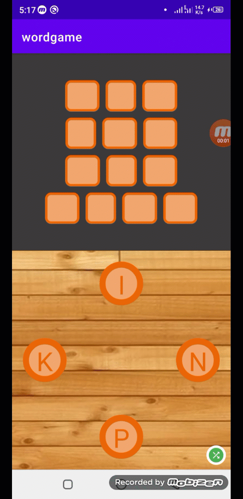

# Android Word Game SDK
Games like WordConnect, WordLink on google play store has high market value and can earn millions of dollers. So here I have decided to develop such SDK which can be implemented easily to develop  app like wordconnect in just few lines of code.

## Step 1:
Implement the SDK
*1.1 (settings.gradle)*
```
repositories {
        google()
        mavenCentral()
        maven { url 'https://jitpack.io' }
    }
```
*1.2 (app module gradle)*
```
	        implementation 'com.github.farimarwat:android-word-game-sdk:1.2'
```

## Step 2:

Place GamePadView in desired activity:
```
<pk.farimarwat.wordgamepad.GamePadView
        android:id="@+id/padview"
        android:layout_width="match_parent"
        android:layout_height="wrap_content"
        app:layout_constraintBottom_toBottomOf="parent"
        app:layout_constraintEnd_toEndOf="parent"
        app:layout_constraintStart_toStartOf="parent"
        app:layout_constraintTop_toBottomOf="@+id/container_wordview"
         />
```
Initialize the GamePadView and add Listener:
```
 val list_answers = mutableListOf<TAnswer>()
        list_answers.add(TAnswer("CUP",false))
        list_answers.add(TAnswer("UP",false))
	
        mTLevel = TLevel("UCP",list_answers)
        binding.padview.setWordList(mTLevel)
        binding.padview.addListener(object :PadViewListener{
            override fun onLetterAdded(item: PadButton, selected: List<PadButton>?) {
               var word = ""
                selected?.let {
                    for(item in it){
                        word += item.title.toString()
                    }
                    binding.txtSelectedLetters.apply {
                        visibility = View.VISIBLE
                        text = word
                    }
                }
            }

            override fun onDragCompleted(list: List<PadButton>) {
                binding.txtSelectedLetters.visibility = View.GONE
                if(list.isNotEmpty()){
                    var word = ""
                    for(item in list){
                        word += item.title
                    }
                    checkWord(word)
                }
            }

        })
```
## Step 3:
Create item_wordview.xml(name it as your desired) in layouts folder. We will inflate it to populate the board of the letters:
```
<?xml version="1.0" encoding="utf-8"?>
<RelativeLayout xmlns:android="http://schemas.android.com/apk/res/android"
    xmlns:app="http://schemas.android.com/apk/res-auto"
    android:id="@+id/container_wordview"
    android:layout_width="wrap_content"
    android:layout_height="wrap_content"
    android:layout_margin="4dp">
    <pk.farimarwat.wordgamepad.GameWordView
        android:id="@+id/gamewordview"
        android:layout_width="match_parent"
        android:layout_height="wrap_content"
        app:gwv_textsize="24dp"
        app:gwv_textcolor="@color/white"
        />
</RelativeLayout>
```
Populate it using the same level which is create above:
```
for(answer in level.listanswers){
            val view = LayoutInflater.from(mContext)
                .inflate(R.layout.item_wordview,null)
            val rl_container = view.findViewById<RelativeLayout>(R.id.container_wordview)
            val params = RelativeLayout.LayoutParams(
                RelativeLayout.LayoutParams.WRAP_CONTENT,
                RelativeLayout.LayoutParams.WRAP_CONTENT
            )
            params.setMargins(10,10,10,10)
            rl_container.layoutParams = params
            val wordview = view.findViewById<GameWordView>(R.id.gamewordview)
            wordview.setWord(answer.answer)
            binding.containerWordview.addView(rl_container)
        }
```
# Thats it. Enjoy
Sample app is included in the repository.

## GamePadView XML Attributes:
|  Attribute |Details   |
| ------------ | ------------ |
|  pv_backgroundimage |  To set padview background |
|  pv_buttonglowcolor | Button glow color while selected   |
| pv_buttoncolor | Color of button  |
| pv_buttonstrokecolor | Circle color around button  |
| pv_buttontextcolor | Letter color on the button  |
|pv_draglinecolor  | Dragging line color between two buttons  |

## GameWordView XML Attributes:
|  Attribute |Details   |
| ------------ | ------------ |
|  gwv_word | Set a word  |
|  gwv_boxsize | Box size for showing a single letter  |
|  gwv_textsize |  Letter size |
| gwv_textcolor  |  Letter color |
| gwv_backgrounddrawable  | To change background of each letter  |

